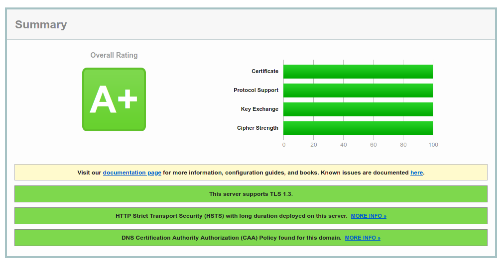

# Installation guide of Mattermost on CentOS 7 (advanced options)

This section is only valid if you have followed the [standard installation of Mattermost on CentOS 7](mattermost-centos-7.md) and concerns advanced and optional nice to have features like TLS 1.3 support.

## TLS 1.3 support and perfect SSL labs test

CentOS 7 has an outdated version of OpenSSL. In order to get support for TLS 1.3, let's compile a new version and relink it to NGINX. [src.](https://dev.to/bidhanahdib/how-to-enable-tls-1-3-in-nginx-with-openssl-centos-7-4f4b)

### Build a new OpenSSL version

Build and install a new version of OpenSSL:
```
# cd /usr/src
# yum install gcc gcc-c++ pcre-devel zlib-devel make unzip gd-devel perl-ExtUtils-Embed libxslt-devel openssl-devel perl-Test-Simple
# curl -LOC - https://www.openssl.org/source/openssl-1.1.1g.tar.gz
# tar xvf openssl-1.1.1g.tar.gz
# cd openssl-1.1.1g/
# ./config --prefix=/usr/local/openssl --openssldir=/usr/local/openssl --libdir=/lib64 shared zlib-dynamic
# make
# make install
# mv /usr/bin/openssl /usr/bin/openssl-backup 
# ln -s /usr/local/openssl/bin/openssl /usr/bin/openssl
```

Check whether you now have the new version:
```
# openssl version
OpenSSL 1.1.1g  21 Apr 2020
```

Check whether TLS 1.3 support has been properly compiled:
```
# openssl ciphers -v | awk '{print $2}' | sort | uniq
SSLv3
TLSv1
TLSv1.2
TLSv1.3
```

### Rebuild NGINX

Even if CentOS comes with NGINX 1.16.1 out of the box and we could recompile that exact same version, why not use the latest version brought by upstream instead?

```
# cd /usr/src/
# curl -LOC - http://nginx.org/download/nginx-1.19.2.tar.gz
# tar xvf nginx-1.19.2.tar.gz
# cd nginx-1.19.2/
# ./configure --prefix=/usr/share/nginx --sbin-path=/usr/sbin/nginx \
--modules-path=/usr/lib64/nginx/modules \
--conf-path=/etc/nginx/nginx.conf \
--error-log-path=/var/log/nginx/error.log \
--http-log-path=/var/log/nginx/access.log \
--http-client-body-temp-path=/var/lib/nginx/tmp/client_body \
--http-proxy-temp-path=/var/lib/nginx/tmp/proxy \
--http-fastcgi-temp-path=/var/lib/nginx/tmp/fastcgi \
--http-uwsgi-temp-path=/var/lib/nginx/tmp/uwsgi \
--http-scgi-temp-path=/var/lib/nginx/tmp/scgi \
--pid-path=/run/nginx.pid \
--lock-path=/run/lock/subsys/nginx --user=nginx \
--group=nginx \
--with-file-aio  \
--with-http_ssl_module \
--with-http_v2_module \
--with-http_realip_module \
--with-stream_ssl_preread_module \
--with-http_addition_module \
--with-http_xslt_module=dynamic \
--with-http_image_filter_module=dynamic \
--with-http_sub_module \
--with-http_dav_module \
--with-http_flv_module \
--with-http_mp4_module \
--with-http_gunzip_module \
--with-http_gzip_static_module \
--with-http_random_index_module \
--with-http_secure_link_module \
--with-http_degradation_module \
--with-http_slice_module \
--with-http_stub_status_module \
--with-http_perl_module=dynamic \
--with-http_auth_request_module \
--with-mail=dynamic \
--with-mail_ssl_module \
--with-pcre \
--with-pcre-jit \
--with-stream=dynamic \
--with-stream_ssl_module \
--with-openssl=/usr/src/openssl
# make
# make install
```

Check whether you now have the new version:
```
# nginx -V
nginx version: nginx/1.19.2
built by gcc 4.8.5 20150623 (Red Hat 4.8.5-39) (GCC)
built with OpenSSL 1.1.1g  21 Apr 2020
[...]
```

### SSL ciphers

Renew the SSL certificate and ask `certbot` to use 4096-bit keys instead of the default 2048 bit:
```
# certbot renew --rsa-key-size 4096
```

In the NGINX config file (`/etc/nginx/conf.d/mattermost.conf`), change the SSL related values to:
```
[...]
ssl_protocols TLSv1.2 TLSv1.3;
ssl_ciphers TLS13-AES-256-GCM-SHA384:TLS13-CHACHA20-POLY1305-SHA256:TLS_AES_256_GCM_SHA384:TLS-AES-256-GCM-SHA384:TLS_CHACHA20_POLY1305_SHA256:TLS-CHACHA20-POLY1305-SHA256:ECDHE-ECDSA-AES256-GCM-SHA384:ECDHE-ECDSA-CHACHA20-POLY1305:ECDHE-ECDSA-AES256-SHA384:ECDHE-RSA-AES256-GCM-SHA384:ECDHE-RSA-CHACHA20-POLY1305:ECDHE-RSA-AES256-SHA384:ECDHE-ECDSA-AES256-SHA:ECDHE-RSA-AES256-SHA;
ssl_prefer_server_ciphers on;
# We don't need a pre-master Diffie-Hellman since we are not using DH based
# ciphers.
# Generated with: openssl dhparam -out ./dh4096.pem 4096
#ssl_dhparam /etc/nginx/ssl/dh4096.pem;
ssl_ecdh_curve secp521r1:secp384r1;
ssl_session_cache shared:SSL:50m;
ssl_session_timeout 1d;
# HSTS (ngx_http_headers_module is required) (15768000 seconds = 6 months)
add_header Strict-Transport-Security max-age=15768000;
# OCSP Stapling ---
# fetch OCSP records from URL in ssl_certificate and cache them
ssl_stapling on;
ssl_stapling_verify on;
[...]
```

The RFC 8446 defining the implementation of TLS 1.3 is requiring the cipher TLS_AES_128_GCM_SHA256 in order to be compliant. However that cipher is detected by the SSL Qualys test as being weak because using a 128 bit algorithm. A fix is on its way. In order to bypass this restriction and still get 100%, we will have to ask OpenSSL to not use this cipher, but at the price of TLS1.3 compliance. [src.](https://github.com/ssllabs/ssllabs-scan/issues/636) [src.](https://serverfault.com/a/990952)

To know where to change this value we used `strace` against the `nginx` binary:
```
# strace -e trace=open,close,read,write,connect,accept nginx
[...]
open("/usr/src/openssl/.openssl/ssl/openssl.cnf", O_RDONLY) = 4
[...]
```

We now know the exact location of the OpenSSL configuration file. In our case, let's open `/usr/src/openssl/.openssl/ssl/openssl.cnf`, and make sure the end of the file appears like the following. The two last lines will ensure a 256 bit based algorithm will be used.
```
[...]
[ system_default_sect ]
MinProtocol = TLSv1.2
CipherString = DEFAULT@SECLEVEL=2
Ciphersuites = TLS_AES_256_GCM_SHA384:TLS_CHACHA20_POLY1305_SHA256
Options = ServerPreference,PrioritizeChaCha
```

Pay attention that this specific OpenSSL configuration file is due to the fact we have been using a custom rebuilt NGINX version. For other systems, your mileage may vary. [src.](https://github.com/ssllabs/ssllabs-scan/issues/636#issuecomment-632616034) [src.](https://dawnbringer.net/blog/1083/TLS%20All%20The%20Things!%20Perfect%20ssl-labs%20score%20for%20Nginx)

Check the 100% https connection robustness on [SSL Labs](https://www.ssllabs.com/ssltest/), but don't forget to check the following checkbox on the webpage to avoid the website to be promoted to the recently checked section of SSL Labs.
```
[x] Do not show the results on the boards
```



In the future, don't forget to check the values returned by the [Mozilla SSL Configuration Generator](https://ssl-config.mozilla.org).
