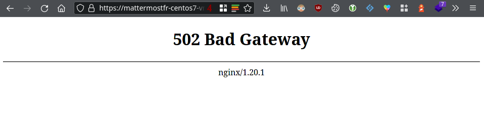
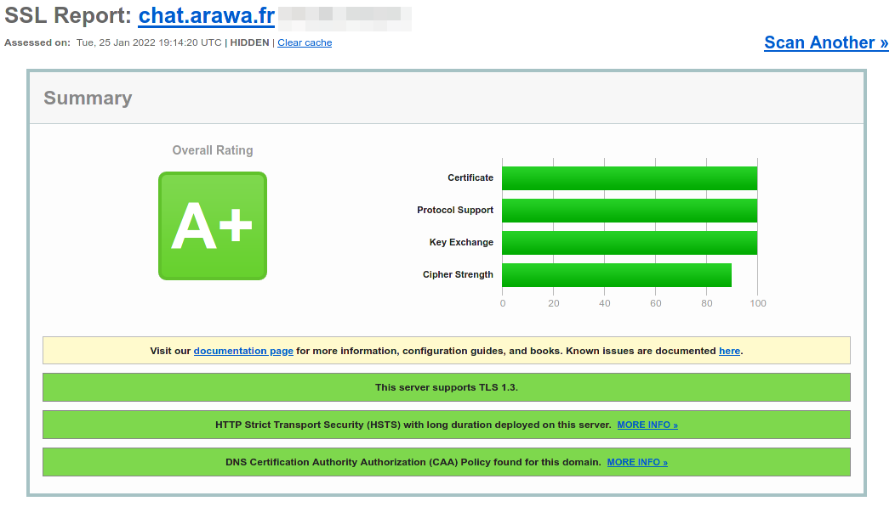

# Mattermost installation on CentOS 7

From a perspective in the years 2020 and onwards, we could say CentOS 7 is providing quite an old technical stack which means all the hardened features that have been developed since that OS version has been out are not available easily or even not available at all.

This guide aims at bringing a production installation as stable as possible with some compromises taken on the long term support mantra this OS tries to provide as we are using the EPEL repositories in order to bring some advanced features and the latest version of Mattermost available.

## Installation

At Arawa, servers are provisioned using Ansible and are populated with `firewalld`. To start clean, you can disable it for now (we will reconfigure it properly later in this guide):
```
# systemctl stop firewalld
```

First thing first, let's add the Extra Packages for Enterprise Linux (EPEL) repos:
```
# yum -y install epel-release
```

By default, that package should already be installed:
```
[...]
Package epel-release-7-12.noarch already installed and latest version
Nothing to do
```

We will be using adding [a well maintained community maintained Mattermost repository](https://gitlab.com/harbottle/harbottle-main/-/tree/master/). The latter is not as hardened as the one provided on Arch Linux due to unmet systemd dependency preriquisites, but it is perfectly suitable for a production environment.

Just confirm the install process:
```
# yum -y install https://harbottle.gitlab.io/harbottle-main/7/x86_64/harbottle-main-release.rpm
```

Install Mattermost from the repo:
```
# yum -y install mattermost mmctl
```

## Database setup

The MariaDB version provided with CentOS 7 (MariaDB 5.5) is a bit outdated. It seems it doesn't support full index on InnoDB, we had the following error message: "The used table type doesn't support FULLTEXT indexes". We [switched](https://mariadb.com/resources/blog/installing-mariadb-10-on-centos-7-rhel-7/) to the upstream MariaDB version (10.x).
```
# curl -LOC - https://downloads.mariadb.com/MariaDB/mariadb_repo_setup
# chmod +x mariadb_repo_setup
# ./mariadb_repo_setup
# yum install MariaDB-server
```

Start the MariaDB service to perform the initial secure installation of MariaDB. Just follow the on-screen instructions.
```
# systemctl start mariadb.service
# mariadb-secure-installation
```

Connect as root to the database, create the database, a dedicated user for Mattermost and grant privileges to it.
```
$ mysql -u root -p
```

Inside the MariaDB shell:
```
CREATE DATABASE mattermostdb;
CREATE USER mmuser IDENTIFIED BY 'mmuser_password';
GRANT ALL ON mattermostdb.* TO mmuser;
```

Ensure the MariaDB server is running at boot:
```
# systemctl enable mariadb.service
```

## Configuring Mattermost

The Mattermost configuration happens in the file `/etc/mattermost/config.json`.

Let's specify the correct `DriverName` and `DataSource`:
```
[...]
"SqlSettings": {
    "DriverName": "mysql",
    "DataSource": "mmuser:mmuser_password@tcp(localhost:3306)/mattermostdb?charset=utf8mb4,utf8",
[...]
```

Let's change the default language to French:
```
[...]
"LocalizationSettings": {
    "DefaultServerLocale": "fr",
    "DefaultClientLocale": "fr",
    "AvailableLocales": ""
},
[...]
```

If your are deploying a Mattermost for testing purposes, you may be interested in lowering the password complexity:
```
[...]
"PasswordSettings": {
    "MinimumLength": 5,
    "Lowercase": true,
    "Number": true,
    "Uppercase": true,
    "Symbol": true
},
[...]
```

By default with Mattermost, all API nodes are not enabled by default. With Arawa, as we are often doing tests, it was interesting for us to remove the testing user accounts we create. Indeed, by default, for conformance/compliance reasons, Mattermost only offers the ability to disable accounts, not remove them. Removing them is only possible on the CLI side via `mmctl`. Enabling these API nodes allows this feature.
```
"ServiceSettings": {
[...]
    "EnableAPIUserDeletion": true,
[...]
```

Start and enable the Mattermost service:
```
# systemctl start mattermost
# systemctl enable mattermost
```

The service is by default listening on all interfaces only in IPv6. This means configuring a firewall will be needed, otherwise, Mattermost will still be reachable on :8065 to the public, something we don't want. To confirm the situation, we can check it with `ss`:
```
$ ss -tuanp | grep LISTEN | grep 8065
tcp    LISTEN     0      128    [::]:8065               [::]:*                   users:(("mattermost",pid=1115,fd=19))
```

To check out if Mattermost is answering without any issue, we can use `curl`:
```
$ curl -g 'http://[::1]:8065'
```

## Nginx reverse proxy with SSL frontend

### Nginx http installation

Let's install nginx:
```
# yum install nginx
```

Contrary to more recent versions of CentOS, virtual hosts are configured in `/etc/nginx/conf.d/` and not using the apache2 inspired directory structure (`/etc/nginx/sites-available/` and `/etc/nginx/sites-enabled/`). If needed, these folders can be created easily and sourced from `/etc/nginx/nginx.conf`. Right now, the location of these virtual hosts is defined by this statement:
```
include /etc/nginx/conf.d/*.conf;
```

Create a file `/etc/nginx/letsencrypt.conf` with the following content:
```
location ^~ /.well-known/acme-challenge/ {
  allow all;
  root /var/lib/letsencrypt/;
  default_type "text/plain";
  try_files $uri =404;
}
```

Create a file `/etc/nginx/conf.d/mattermost.conf` with the following content:
```
server {
   listen 80 default_server;
   listen [::]:80;

   server_name your_subdomain.example.com;

   # Redirect everything except the Let's Encrypt webroot location which must be
   # HTTP/1 only to avoid this error: "Server is speaking HTTP/2 over HTTP".
   # cf. https://community.letsencrypt.org/t/certbot-nginx-method-fails-server-is-speaking-http-2-over-http/99206
   location / {
      return 301 https://$server_name$request_uri;
   }
   include letsencrypt.conf;
}
```

Start and enable nginx:
```
# systemctl start nginx
# systemctl enable nginx
```

From your own computer, check if the NGINX config is working properly. The root of your domain and any random location like `/blablabla` should redirect you (`Ctrl-C` to stop as the connection will hang):
```
$ curl -IL http://your_subdomain.example.com/blablabla
HTTP/1.1 301 Moved Permanently
[...]
Location: https://your_subdomain.example.com

curl: (28) Failed to connect to your_subdomain.example.com port 443 after 128886 ms: Connection timed out
```

The redirection will work everywhere, except for `http://your_subdomain.example.com/.well-known/acme-challenge/`
```
$ curl -IL http://your_subdomain.example.com/.well-known/acme-challenge/
HTTP/1.1 404 Not Found
[...]
```

If you get the same results as just above, you are ready to continue.

### Enable https

Install certbot and the nginx plugin for certbot
```
# yum install certbot certbot-nginx
```

Due to the lack of HTTP2 support with certbot ([src.](https://github.com/certbot/certbot/issues/3646)), we are not able to use `certbot renew` to adapt the NGINX configuration and restart the NGINX server automatically. Therefore, we need to perform a semi manual installation of the certificate.

Also, NGINX [is not able to perform a HTTP/1.1 -> HTTP/2 h2c protocol upgrade](https://community.letsencrypt.org/t/certbot-nginx-method-fails-server-is-speaking-http-2-over-http/99206/5) meaning Boundler, the server used by Let's Encrypt to perform the challenge exchange, can only assume the server speaks HTTP/1.1 and complains with the error: "Server is speaking HTTP/2 over HTTP". To avoid this, we need to have a HTTP/1.1 virtual host before doing the redirection.

The email address specified is only used to send reminders in the event the certificate is expiring soon.


In `/etc/letsencrypt/cli.ini`, add the following statement to force the generation of 4096 bits keys. Specifing this setting in that file avoids to specify it again manually in the command line or in the `certbot renew` statements below. This setting can also be specified for a specific host in `/etc/letsencrypt/renewal/`. ([src.](https://certbot.eff.org/docs/using.html#modifying-the-renewal-configuration-file))
```
rsa-key-size = 4096
```

In order to avoid rate limits, let's do a dry test first (materialized by the `--dry-run` argument):
```
# certbot certonly --nginx --dry-run --non-interactive -d your_subdomain.example.com --post-hook "systemctl reload nginx" --email your-email@example.com --agree-tos
Saving debug log to /var/log/letsencrypt/letsencrypt.log
Plugins selected: Authenticator nginx, Installer nginx
Starting new HTTPS connection (1): acme-staging-v02.api.letsencrypt.org
Account registered.
Simulating a certificate request for your_subdomain.example.com
Performing the following challenges:
http-01 challenge for your_subdomain.example.com
Waiting for verification...
Cleaning up challenges
Running post-hook command: systemctl reload nginx

IMPORTANT NOTES:
 - The dry run was successful.
```

If this succeeds, restart the process without the `--dry-run` argument:
```
# certbot certonly --nginx --non-interactive -d your_subdomain.example.com --post-hook "systemctl reload nginx" --email your-email@example.com --agree-tos
Saving debug log to /var/log/letsencrypt/letsencrypt.log
Plugins selected: Authenticator nginx, Installer nginx
Starting new HTTPS connection (1): acme-v02.api.letsencrypt.org
Account registered.
Requesting a certificate for your_subdomain.example.com
Performing the following challenges:
http-01 challenge for your_subdomain.example.com
Waiting for verification...
Cleaning up challenges
Running post-hook command: systemctl reload nginx

IMPORTANT NOTES:
 - Congratulations! Your certificate and chain have been saved at:
   /etc/letsencrypt/live/your_subdomain.example.com/fullchain.pem
   Your key file has been saved at:
   /etc/letsencrypt/live/your_subdomain.example.com/privkey.pem
   Your certificate will expire on 2022-04-26. To obtain a new or
   tweaked version of this certificate in the future, simply run
   certbot again. To non-interactively renew *all* of your
   certificates, run "certbot renew"
 - If you like Certbot, please consider supporting our work by:

   Donating to ISRG / Let's Encrypt:   https://letsencrypt.org/donate
   Donating to EFF:                    https://eff.org/donate-le

```

Replace the `mattermost.conf` nginx file with this one making sure to adapt the `server_name` and certificate locations for `ssl_certificate` and `ssl_certificate_key`:
```
upstream backend {
   server [::1]:8065;
   keepalive 32;
}

proxy_cache_path /var/cache/nginx levels=1:2 keys_zone=mattermost_cache:10m max_size=3g inactive=120m use_temp_path=off;

server {
   listen 80;
   listen [::]:80;

   server_name your_subdomain.example.com;

   # Redirect everything except the Let's Encrypt webroot location which must be
   # HTTP/1 only to avoid this error: "Server is speaking HTTP/2 over HTTP".
   # cf. https://community.letsencrypt.org/t/certbot-nginx-method-fails-server-is-speaking-http-2-over-http/99206
   location / {
      return 301 https://$server_name$request_uri;
   }
   include letsencrypt.conf;
}

server {
   listen 443 ssl http2;
   listen [::]:443 ssl http2;
   server_name your_subdomain.example.com;

   ssl_certificate /etc/letsencrypt/live/your_subdomain.example.com/fullchain.pem;
   ssl_certificate_key /etc/letsencrypt/live/your_subdomain.example.com/privkey.pem;

   ssl_protocols TLSv1.2 TLSv1.3;
   ssl_ciphers TLS13-AES-256-GCM-SHA384:TLS13-CHACHA20-POLY1305-SHA256:TLS_AES_256_GCM_SHA384:TLS-AES-256-GCM-SHA384:TLS_CHACHA20_POLY1305_SHA256:TLS-CHACHA20-POLY1305-SHA256:ECDHE-ECDSA-AES256-GCM-SHA384:ECDHE-ECDSA-CHACHA20-POLY1305:ECDHE-ECDSA-AES256-SHA384:ECDHE-RSA-AES256-GCM-SHA384:ECDHE-RSA-CHACHA20-POLY1305:ECDHE-ECDSA-AES256-SHA;
   ssl_prefer_server_ciphers on;
   # We don't need a pre-master Diffie-Hellman since we are not using DH based
   # ciphers.
   # Generated with: openssl dhparam -out ./dh4096.pem 4096
   #ssl_dhparam /etc/nginx/ssl/dh4096.pem;
   ssl_ecdh_curve secp521r1:secp384r1;
   ssl_session_cache shared:SSL:50m;
   ssl_session_timeout 1d;
   # HSTS (ngx_http_headers_module is required) (15768000 seconds = 6 months)
   add_header Strict-Transport-Security max-age=15768000;
   # OCSP Stapling ---
   # fetch OCSP records from URL in ssl_certificate and cache them
   ssl_stapling on;
   ssl_stapling_verify on;

   location ~ /api/v[0-9]+/(users/)?websocket$ {
       proxy_set_header Upgrade $http_upgrade;
       proxy_set_header Connection "upgrade";
       client_max_body_size 50M;
       proxy_set_header Host $http_host;
       proxy_set_header X-Real-IP $remote_addr;
       proxy_set_header X-Forwarded-For $proxy_add_x_forwarded_for;
       proxy_set_header X-Forwarded-Proto $scheme;
       proxy_set_header X-Frame-Options SAMEORIGIN;
       proxy_buffers 256 16k;
       proxy_buffer_size 16k;
       client_body_timeout 60;
       send_timeout 300;
       lingering_timeout 5;
       proxy_connect_timeout 90;
       proxy_send_timeout 300;
       proxy_read_timeout 90s;
       proxy_pass http://backend;
   }

   location / {
       client_max_body_size 50M;
       proxy_set_header Connection "";
       proxy_set_header Host $http_host;
       proxy_set_header X-Real-IP $remote_addr;
       proxy_set_header X-Forwarded-For $proxy_add_x_forwarded_for;
       proxy_set_header X-Forwarded-Proto $scheme;
       proxy_set_header X-Frame-Options SAMEORIGIN;
       proxy_buffers 256 16k;
       proxy_buffer_size 16k;
       proxy_read_timeout 600s;
       proxy_cache mattermost_cache;
       proxy_cache_revalidate on;
       proxy_cache_min_uses 2;
       proxy_cache_use_stale timeout;
       proxy_cache_lock on;
       proxy_http_version 1.1;
       proxy_pass http://backend;
   }
}
```

Note: Reusing the `$server_name` variable for the directory of the certificate was not working. Using the full path in plain text is needed.

If you need to support these following platforms:
* Android 5 and 6
* Firefox 31
* IE11 on Windows 7 + 8
* iOS < 9
* macOS < 10.11
use this line instead:
```
ssl_ciphers TLS13-AES-256-GCM-SHA384:TLS13-CHACHA20-POLY1305-SHA256:TLS_AES_256_GCM_SHA384:TLS-AES-256-GCM-SHA384:TLS_CHACHA20_POLY1305_SHA256:TLS-CHACHA20-POLY1305-SHA256:ECDHE-ECDSA-AES256-GCM-SHA384:ECDHE-ECDSA-CHACHA20-POLY1305:ECDHE-ECDSA-AES256-SHA384:ECDHE-RSA-AES256-GCM-SHA384:ECDHE-RSA-CHACHA20-POLY1305:ECDHE-RSA-AES256-SHA384:ECDHE-ECDSA-AES256-SHA:ECDHE-RSA-AES256-SHA;
```

In the future, don't forget to check the values returned by the [Mozilla SSL Configuration Generator](https://ssl-config.mozilla.org).

To understand better the mapping of the ciphers used by NGINX and the ones used by OpenSSL, please read the man pages (`man -s 1 openssl ciphers`). ([src.](https://www.openssl.org/docs/manmaster/man1/openssl-ciphers.html))

Check whether the configuration works with:
```
# nginx -t
nginx: the configuration file /etc/nginx/nginx.conf syntax is ok
nginx: configuration file /etc/nginx/nginx.conf test is successful
```

If everything is okay, reload nginx:
```
# systemctl reload nginx
```

### Check Mattermost reachability - Adapt SELinux rules

If you check to see whether
1) Mattermost is reachable in https and
2) the http to https redirection works

on a vanilla CentOS 7 installation, you'll should have this error message:


This is due to the fact SELinux is enforced by default and NGINX is not allowed to establish network connections by itself.

If you check the SELinux logs, the following error message should confirm this assumption:
```
# grep nginx /var/log/audit/audit.log | grep denied
[...]
type=AVC msg=audit(1643213928.476:460): avc:  denied  { name_connect } for  pid=11875 comm="nginx" dest=8065 scontext=system_u:system_r:httpd_t:s0 tcontext=system_u:object_r:unreserved_port_t:s0 tclass=tcp_socket permissive=0
[...]
```

Just disable that particular SELinux policy with (`-P` is to make the change permanent):
```
# setsebool httpd_can_network_connect on -P
```
([src.](https://stackoverflow.com/a/31403848/3514658))

Now Mattermost should be reachable properly.

### Check TLS configuration

Check the https connection robustness on [SSL Labs](https://www.ssllabs.com/ssltest/), but don't forget to check the following checkbox on the webpage to avoid the website to be promoted to the recently checked section of SSL Labs.
```
[x] Do not show the results on the boards
```

### Certificate auto renewal

Setup [auto renewal](https://www.digitalocean.com/community/tutorials/how-to-secure-apache-with-let-s-encrypt-on-centos-7#step-4-%E2%80%94-setting-up-auto-renewal) of the certificate using systemd timer.

Create a systemd service:
```
/etc/systemd/system/certbot-renewal.service
```
```
[Unit]
Description=Certbot Renewal

[Service]
ExecStart=/usr/bin/certbot renew
```

Create the corresponding systemd timer:
```
/etc/systemd/system/certbot-renewal.timer
```
```
[Unit]
Description=Timer for Certbot Renewal

[Timer]
OnCalendar=daily
AccuracySec=12h

[Install]
WantedBy=timers.target
```

Note 1: With `AccuracySec`, the cron is scheduled to run between a time window starting with 00:00 (`daily` keyword) and ending with the configured `AccuracySec` keyword, here `12h`. The expiration time will be chosen randomly in a 12h window time frame, which means certbot will run twice a day at random time. This is quite useful when the cloud provider is performing backups, to avoid an I/O increase which could make the SSL renewal fail.

Note 2: Due to the initial `certbot` invokation we performed above, all the previous parameters (webroot, email, authentication method, and post hook to reload NGINX) have been saved in the directory `/etc/letsencrypt/renewal` and Letsencrypt is just replaying them when needed, no need to respecify in the cron.

Start and enable the timer:
```
# systemctl start certbot-renewal.timer
# systemctl enable certbot-renewal.timer
```

You can chek later if the timer has completed successfully or not with:
```
# systemctl list-timers
NEXT                          LEFT     LAST                          PASSED    UNIT                         ACTIVATES
[...]
Fri 2021-04-23 00:00:00 CEST  22h left n/a                           n/a       certbot-renewal.timer        certbot-renewal.service
[...]
```

## Firewalling

Please make sure you are aware of the [firewalld basic concepts](https://www.digitalocean.com/community/tutorials/how-to-set-up-a-firewall-using-firewalld-on-centos-7#basic-concepts-in-firewalld) first.

At Arawa, servers are provisioned using Ansible aand are populated with `firewalld`. If you are on a vanilla server, you need to install `firewalld` first:
```
# yum install firewalld
```

Start and enable the `firewalld` service as the latter is not enabled by default:
```
# systemctl start firewalld
# systemctl enable firewalld
```

Check the zone which is currently defined and adapt the command hereafter accordingly:
```
# firewall-cmd --get-default-zone
public
```

Authorise http and https:
```
# firewall-cmd --zone=public --add-service=http --add-service=https
```

If the Mattermost instance is still working, you can make these changes permanent:
```
# firewall-cmd --zone=public --permanent --add-service=http --add-service=https
```

Take the opportunity to check that the access via the port `:8065` is being denied.

## Updating Mattermost

The update process is not changing much. Just do a `yum update` and restart the NGINX + MariaDB + Mattermost stack or simply reboot the server in case of kernel or OpenSSL updates.

## OPTIONAL: Perfect SSL labs test

### Introduction

Following a recent addition in the EPEL repository in 2020-11, NGINX is now built against the OpenSSL 1.1 branch which brings support for TLS 1.3. ([src.](https://bodhi.fedoraproject.org/updates/FEDORA-EPEL-2020-1dc525ea93))

Therefore, you should already have a good TLS scoring on the SSL labs test.



Instead of "built against", saying "linked against" would have been more correct as NGINX is litterally linked against an additional lib called `libssl.so`.
```
yum install nginx.x86_64
[...]
--> Processing Dependency: libcrypto.so.1.1(OPENSSL_1_1_0)(64bit) for package: 1:nginx-1.20.1-9.el7.x86_64
--> Processing Dependency: libssl.so.1.1(OPENSSL_1_1_0)(64bit) for package: 1:nginx-1.20.1-9.el7.x86_64
--> Processing Dependency: libssl.so.1.1(OPENSSL_1_1_1)(64bit) for package: 1:nginx-1.20.1-9.el7.x86_64
[...]
```

The `openssl` CLI tool is still linking to the old OpenSSL version which is still present on the system:
```
# openssl version
OpenSSL 1.0.2k-fips  26 Jan 2017
```

In order to be able to know which algorithms are being used by the new OpenSSL 1.1 branch version, install the corresponding CLI tool:
```
# yum install openssl11.x86_64
```

You now can get details about the `libcrypto.so.1.1` and `libssl.so.1.1` libraries:
```
# openssl11 version
OpenSSL 1.1.1k  FIPS 25 Mar 2021
```
```
# openssl11 ciphers -v | awk '{print $2}' | sort | uniq
SSLv3
TLSv1
TLSv1.2
TLSv1.3
```

## Removing 128 bits cipher suites

The RFC 8446 defining the implementation of TLS 1.3 is requiring the cipher TLS_AES_128_GCM_SHA256 in order to be compliant. However that cipher is detected by the SSL Qualys test as being weak because using a 128 bit algorithm. A fix is on its way.

In order to bypass this restriction and still get 100%, we will have to ask OpenSSL to not use this cipher, but at the price of TLS1.3 compliance. ([src.](https://github.com/ssllabs/ssllabs-scan/issues/636)),([src.](https://serverfault.com/a/990952))

While this won't do any harm in practise for this use case, this step breaks TLS 1.3 standard compliance and is therefore **not recommended** and **optional**.

To know where to change this value we used `strace` against the `nginx` binary:
```
# yum install strace
[...]
```
```
# strace -e trace=open,close,read,write,connect,accept nginx
[...]
open("/etc/pki/tls/openssl.cnf", O_RDONLY) = 4
[...]
```

Let's modify the file `/etc/pki/tls/openssl.cnf`.
Add this at the start of the file:
```
# Override default conf:
openssl_conf = openssl_init
```

Add this at the end of the file:
```
# Override default conf:
[openssl_init]
ssl_conf = ssl_configuration

[ssl_configuration]
system_default = tls_system_default

[tls_system_default]
MinProtocol = TLSv1.2
Ciphersuites = TLS_AES_256_GCM_SHA384:TLS_CHACHA20_POLY1305_SHA256
```
([src.](https://github.com/ssllabs/ssllabs-scan/issues/636#issuecomment-632616034)), ([src.](https://dawnbringer.net/blog/1083/TLS%20All%20The%20Things!%20Perfect%20ssl-labs%20score%20for%20Nginx))

To understand better the syntax of this file, please read the man pages (`man -s 5 config`). ([src.](https://www.openssl.org/docs/manmaster/man5/config.html))

The two last lines will ensure a 256 bits based algorithm will be used and replace the default:
```
TLS_AES_256_GCM_SHA384:TLS_CHACHA20_POLY1305_SHA256:TLS_AES_128_GCM_SHA256
```

OpenSSL < 1.1 versions are not understanding the `ssl_conf` key from the configuration file, meaning calling OpenSSL 1.0 requiring this file to be parsed will lead to errors:
```
# openssl ciphers -v | awk '{print $2}' | sort | uniq
Error configuring OpenSSL
139987228915600:error:25066067:DSO support routines:DLFCN_LOAD:could not load the shared library:dso_dlfcn.c:187:filename(libssl_conf.so): libssl_conf.so: cannot open shared object file: No such file or directory
139987228915600:error:25070067:DSO support routines:DSO_load:could not load the shared library:dso_lib.c:233:
139987228915600:error:0E07506E:configuration file routines:MODULE_LOAD_DSO:error loading dso:conf_mod.c:273:module=ssl_conf, path=ssl_conf
139987228915600:error:0E076071:configuration file routines:MODULE_RUN:unknown module name:conf_mod.c:214:module=ssl_conf
```

Check the 100% https connection robustness on [SSL Labs](https://www.ssllabs.com/ssltest/), but don't forget to check the following checkbox on the webpage to avoid the website to be promoted to the recently checked section of SSL Labs.
```
[x] Do not show the results on the boards
```


