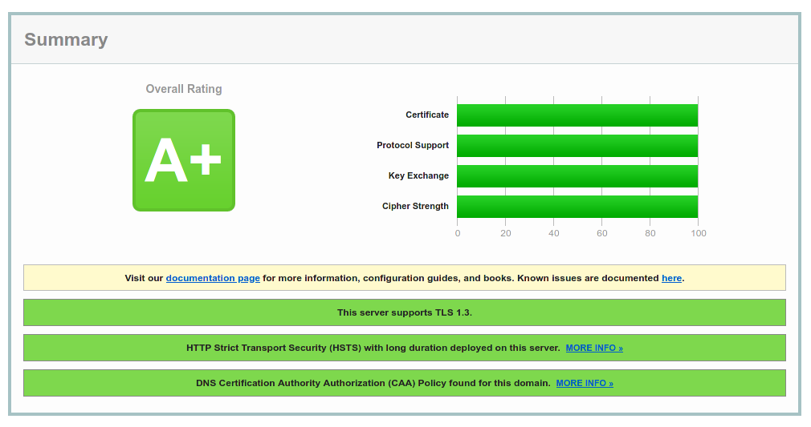

# Mattermost installation on CentOS 7

From a perspective in the years 2020 and onwards, we could say CentOS 7 is providing quite an old technical stack which means all the hardened features that have been developed since that OS version has been out are not available easily or even not available at all.

This guide aims to bring an installation as stable as possible with some compromises taken on the long term support mantra this OS tries to provide in order to bring some advanced features and the latest version of Mattermost available.

## Installation

At Arawa, servers are provisioned using Ansible aand are populated with `firewalld`. To start clean, you can disable it for now:
```
# systemctl stop firewalld
```

First thing first, let's add the Extra Packages for Enterprise Linux repo:
```
# yum -y install epel-release
```

By default, that package should already be installed:
```
[...]
Package epel-release-7-12.noarch already installed and latest version
Nothing to do
```

We will be using adding [a well maintained community maintained Mattermost repository](https://gitlab.com/harbottle/harbottle-main/-/tree/master/). The latter is not as hardened as the one provided on Arch Linux due to unmet dependency preriquisites, but it is perfectly suitable for a production environment.

Just confirm the install process:
```
# yum -y install https://harbottle.gitlab.io/harbottle-main/7/x86_64/harbottle-main-release.rpm
```

Install Mattermost from the repo:
```
# yum -y install mattermost mmctl
```

## Database setup

The MariaDB version provided with CentOS 7 (MariaDB 5.5) is a bit outdated. It seems it doesn't support full index on InnoDB, we had the following error message: "The used table type doesn't support FULLTEXT indexes". We [switched](https://mariadb.com/resources/blog/installing-mariadb-10-on-centos-7-rhel-7/) to the upstream MariaDB version (10.x).
```
# curl -LOC - https://downloads.mariadb.com/MariaDB/mariadb_repo_setup
# chmod +x mariadb_repo_setup
# ./mariadb_repo_setup
# yum install MariaDB-server
```

Start the MariaDB service to perform the initial secure installation of MariaDB. Just follow the on-screen instructions.
```
# systemctl start mariadb.service
# mysql_secure_installation
```

Connect as root to the database, create the database, a dedicated user for Mattermost and grant privileges to it.
```
$ mysql -u root -p
```

Inside the MariaDB shell:
```
CREATE DATABASE mattermostdb;
CREATE USER mmuser IDENTIFIED BY 'mmuser_password';
GRANT ALL ON mattermostdb.* TO mmuser;
```

Ensure the MariaDB server is running at boot:
```
# systemctl enable mariadb.service
```

## Configuring Mattermost

The Mattermost configuration happens in the file `/etc/mattermost/config.json`.

Let's specify the correct `DriverName` and `DataSource`:
```
[...]
"SqlSettings": {
    "DriverName": "mysql",
    "DataSource": "mmuser:mmuser_password@tcp(localhost:3306)/mattermostdb?charset=utf8mb4,utf8",
[...]
```

Let's change the default language to French:
```
[...]
"LocalizationSettings": {
    "DefaultServerLocale": "fr",
    "DefaultClientLocale": "fr",
    "AvailableLocales": ""
},
[...]
```

If your are deploying a Mattermost for testing urpose, you may be interested in lowering the password complexity:
```
[...]
"PasswordSettings": {
    "MinimumLength": 5,
    "Lowercase": true,
    "Number": true,
    "Uppercase": true,
    "Symbol": true
},
[...]
```

Start and enable the Mattermost service:
```
# systemctl start mattermost
# systemctl enable mattermost
```

The service is by default listening on all interfaces only in IPv6. This means configuring a firewall will be needed, otherwise, Mattermost will still be reachable on :8065 to the public, something we don't want. To confirm the situation, we can check it with `ss`:
```
$ ss -tuanp | grep LISTEN | grep 8065
tcp    LISTEN     0      128    [::]:8065               [::]:*                   users:(("mattermost",pid=1115,fd=19))
```

To check out if Mattermost is answering without any issue, we can use `curl`:
```
$ curl -g 'http://[::1]:8065'
```

## Nginx reverse proxy with SSL frontend

### Nginx http installation

Let's install nginx:
```
# yum install nginx.x86_64
```

Contrary to more recent versions of CentOS, virtual hosts are configured in `/etc/nginx/conf.d/` and not using the apache2 inspired directory structure (`/etc/nginx/sites-available/` and `/etc/nginx/sites-enabled/`). If needed, these folders can be created easily and sourced from `/etc/nginx/nginx.conf`. Right now, the location of these virtual hosts is defined by this statement:
```
include /etc/nginx/conf.d/*.conf;
```

Create a file `/etc/nginx/letsencrypt.conf` with the following content:
```
location ^~ /.well-known/acme-challenge/ {
  allow all;
  root /var/lib/letsencrypt/;
  default_type "text/plain";
  try_files $uri =404;
}
```

Create a file `/etc/nginx/conf.d/mattermost.conf` with the following content:
```
server {
   listen 80 default_server;
   listen [::]:80;

   server_name your_subdomain.example.com;

   # Redirect everything except the Let's Encrypt webroot location which must be
   # HTTP/1 only to avoid this error: "Server is speaking HTTP/2 over HTTP".
   # cf. https://community.letsencrypt.org/t/certbot-nginx-method-fails-server-is-speaking-http-2-over-http/99206
   location / {
      return 301 https://$server_name$request_uri;
   }
   include letsencrypt.conf;
}
```

Start and enable nginx:
```
# systemctl start nginx
# systemctl enable nginx
```

From your own computer, check if the NGINX config is working properly. The root of your domain and any random location like `/blablabla` should redirect you, except `http://your_subdomain.example.com/.well-known/acme-challenge/`:
```
$ curl -IL http://your_subdomain.example.com/blablabla
HTTP/1.1 301 Moved Permanently
[...]
Location: https://your_subdomain.example.com

HTTP/2 200
[...]
```
```
$ curl -IL http://chat.arawa.fr/.well-known/acme-challenge/
HTTP/1.1 404 Not Found
[...]
```

If this works, you can make these changes permanent:
Authorise http and https:
```
# firewall-cmd --zone=public --permanent --add-service=http --add-service=https
```

### Enable https

Install certbot and the nginx plugin for certbot
```
# yum install certbot certbot-nginx
```

Due to [this certbot bug](https://github.com/certbot/certbot/issues/3646), we are not able to use `certbot renew` to adapt the NGINX configuration and restart the NGINX server automatically, therefore we need to perform a semi manual installation of the certificate.

Also, NGINX [is not able to perform a HTTP/1.1 -> HTTP/2 h2c protocol upgrade](https://community.letsencrypt.org/t/certbot-nginx-method-fails-server-is-speaking-http-2-over-http/99206/5), therefore, Boundler, the server used by Let's Encrypt to perform the challenge exchange, can only assume the server speaks HTTP/1.1 and complains with the error: "Server is speaking HTTP/2 over HTTP". To avoid this, let's create a HTTP/1.1 only server before doing the redirection.

The email address specified is only used to send reminders in the event the certificate is expiring soon.

In order to avoid rate limits, let's do a test first (materialized by the `--dry-run` parameter).

In `/etc/letsencrypt/cli.ini`, add the following statement to force the generation of 4096 bits keys. Specifing this setting in that file avoids to specify it again manually in the command line or in the `certbot renew` statements below. This setting can also be specified for a specific host in `/etc/letsencrypt/renewal/` [src.](https://certbot.eff.org/docs/using.html#modifying-the-renewal-configuration-file)
```
rsa-key-size = 4096
```
```
# certbot certonly --nginx --dry-run --non-interactive -d your_subdomain.example.com --post-hook "systemctl reload nginx" --email your-email@example.com --agree-tos
```

```
Saving debug log to /var/log/letsencrypt/letsencrypt.log
Plugins selected: Authenticator nginx, Installer nginx
Starting new HTTPS connection (1): acme-v02.api.letsencrypt.org
Cert is due for renewal, auto-renewing...
Renewing an existing certificate
Performing the following challenges:
http-01 challenge for your_subdomain.example.com
Waiting for verification...
Cleaning up challenges
Running post-hook command: systemctl reload nginx

IMPORTANT NOTES:
 - Congratulations! Your certificate and chain have been saved at:
   /etc/letsencrypt/live/your_subdomain.example.com/fullchain.pem
   Your key file has been saved at:
   /etc/letsencrypt/live/your_subdomain.example.com/privkey.pem
   Your cert will expire on 2020-09-21. To obtain a new or tweaked
   version of this certificate in the future, simply run certbot
   again. To non-interactively renew *all* of your certificates, run
   "certbot renew"
 - If you like Certbot, please consider supporting our work by:

   Donating to ISRG / Let's Encrypt:   https://letsencrypt.org/donate
   Donating to EFF:                    https://eff.org/donate-le
```

Replace the `mattermost.conf` nginx file as follow:
```
upstream backend {
   server [::1]:8065;
   keepalive 32;
}

proxy_cache_path /var/cache/nginx levels=1:2 keys_zone=mattermost_cache:10m max_size=3g inactive=120m use_temp_path=off;

server {
   listen 80 default_server;
   listen [::]:80;

   server_name your_subdomain.example.com;

   # Redirect everything except the Let's Encrypt webroot location which must be
   # HTTP/1 only to avoid this error: "Server is speaking HTTP/2 over HTTP".
   # cf. https://community.letsencrypt.org/t/certbot-nginx-method-fails-server-is-speaking-http-2-over-http/99206
   location / {
      return 301 https://$server_name$request_uri;
   }
   include letsencrypt.conf;
}

server {
   listen 443 ssl http2;
   listen [::]:443 ssl http2;
   server_name your_subdomain.example.com;

   ssl_certificate /etc/letsencrypt/live/your_subdomain.example.com/fullchain.pem;
   ssl_certificate_key /etc/letsencrypt/live/your_subdomain.example.com/privkey.pem;

   ssl_protocols TLSv1.2 TLSv1.3;
   ssl_ciphers TLS13-AES-256-GCM-SHA384:TLS13-CHACHA20-POLY1305-SHA256:TLS_AES_256_GCM_SHA384:TLS-AES-256-GCM-SHA384:TLS_CHACHA20_POLY1305_SHA256:TLS-CHACHA20-POLY1305-SHA256:ECDHE-ECDSA-AES256-GCM-SHA384:ECDHE-ECDSA-CHACHA20-POLY1305:ECDHE-ECDSA-AES256-SHA384:ECDHE-RSA-AES256-GCM-SHA384:ECDHE-RSA-CHACHA20-POLY1305:ECDHE-RSA-AES256-SHA384:ECDHE-ECDSA-AES256-SHA:ECDHE-RSA-AES256-SHA;
   ssl_prefer_server_ciphers on;
   # We don't need a pre-master Diffie-Hellman since we are not using DH based
   # ciphers.
   # Generated with: openssl dhparam -out ./dh4096.pem 4096
   #ssl_dhparam /etc/nginx/ssl/dh4096.pem;
   ssl_ecdh_curve secp521r1:secp384r1;
   ssl_session_cache shared:SSL:50m;
   ssl_session_timeout 1d;
   # HSTS (ngx_http_headers_module is required) (15768000 seconds = 6 months)
   add_header Strict-Transport-Security max-age=15768000;
   # OCSP Stapling ---
   # fetch OCSP records from URL in ssl_certificate and cache them
   ssl_stapling on;
   ssl_stapling_verify on;

   location ~ /api/v[0-9]+/(users/)?websocket$ {
       proxy_set_header Upgrade $http_upgrade;
       proxy_set_header Connection "upgrade";
       client_max_body_size 50M;
       proxy_set_header Host $http_host;
       proxy_set_header X-Real-IP $remote_addr;
       proxy_set_header X-Forwarded-For $proxy_add_x_forwarded_for;
       proxy_set_header X-Forwarded-Proto $scheme;
       proxy_set_header X-Frame-Options SAMEORIGIN;
       proxy_buffers 256 16k;
       proxy_buffer_size 16k;
       client_body_timeout 60;
       send_timeout 300;
       lingering_timeout 5;
       proxy_connect_timeout 90;
       proxy_send_timeout 300;
       proxy_read_timeout 90s;
       proxy_pass http://backend;
   }

   location / {
       client_max_body_size 50M;
       proxy_set_header Connection "";
       proxy_set_header Host $http_host;
       proxy_set_header X-Real-IP $remote_addr;
       proxy_set_header X-Forwarded-For $proxy_add_x_forwarded_for;
       proxy_set_header X-Forwarded-Proto $scheme;
       proxy_set_header X-Frame-Options SAMEORIGIN;
       proxy_buffers 256 16k;
       proxy_buffer_size 16k;
       proxy_read_timeout 600s;
       proxy_cache mattermost_cache;
       proxy_cache_revalidate on;
       proxy_cache_min_uses 2;
       proxy_cache_use_stale timeout;
       proxy_cache_lock on;
       proxy_http_version 1.1;
       proxy_pass http://backend;
   }
}
```

Note: Reusing the `$server_name` variable for the directory of the certificate was not working. Using the full path in plain text is needed.

Check whether the configuration works with:
```
# nginx -t
nginx: the configuration file /etc/nginx/nginx.conf syntax is ok
nginx: configuration file /etc/nginx/nginx.conf test is successful
```

If everything is okay, reload nginx:
```
# systemctl reload nginx
```

Check if Mattermost is reachable in https and ensure that the access via the port `:8065` is being denied.

Check the https connection robustness on [SSL Labs](https://www.ssllabs.com/ssltest/), but don't forget to check the following checkbox on the webpage to avoid the website to be promoted to the recently checked section of SSL Labs.
```
[x] Do not show the results on the boards
```

## Certificate auto renewal

Setup [auto renewal](https://www.digitalocean.com/community/tutorials/how-to-secure-apache-with-let-s-encrypt-on-centos-7#step-4-%E2%80%94-setting-up-auto-renewal) of the certificate using systemd timer.

Create a systemd service:
```
/etc/systemd/system/certbot-renewal.service
```
```
[Unit]
Description=Certbot Renewal

[Service]
ExecStart=/usr/bin/certbot renew
```

Create the corresponding systemd timer:
```
/etc/systemd/system/certbot-renewal.timer
```
```
[Unit]
Description=Timer for Certbot Renewal

[Timer]
OnCalendar=daily
AccuracySec=12h

[Install]
WantedBy=timers.target
```

Note 1: With `AccuracySec`, the cron is scheduled to run between a time window starting with 00:00 (`daily` keyword) and ending with the configured `AccuracySec` keyword, here `12h`. The expiration time will be chosen randomly in a 12h window time frame, which means certbot will run twice a day at random time. This is quite useful when the cloud provider is performing backups, to avoid an I/O increase which could make the SSL renewal fail.

Note 2: Due to the initial `certbot` invokation we performed above, all the previous parameters (webroot, email, authentication method, and post hook to reload NGINX) have been saved in the directory `/etc/letsencrypt/renewal` and Letsencrypt is just replaying them when needed, no need to respecify in the cron.

Enable and start the timer:
```
# systemctl enable certbot-renewal.timer
# systemctl start certbot-renewal.timer
```

You can chek later if the timer has completed successfully or not with:
```
# systemctl list-timers
NEXT                          LEFT     LAST                          PASSED    UNIT                         ACTIVATES
[...]
Fri 2021-04-23 00:00:00 CEST  22h left n/a                           n/a       certbot-renewal.timer        certbot-renewal.service
[...]
```

## Firewalling

Please make sure you are aware of the [firewalld basic concepts](https://www.digitalocean.com/community/tutorials/how-to-set-up-a-firewall-using-firewalld-on-centos-7#basic-concepts-in-firewalld) first.

Start and enable the `firewalld` service as the latter is not enabled by default:
```
# systemctl start firewalld
# systemctl enable firewalld
```

Check the zone which is currently defined and adapt the command hereafter accordingly:
```
# firewall-cmd --get-default-zone
public
```

Authorise http and https:
```
# firewall-cmd --zone=public --add-service=http --add-service=https
```

# Installation guide of Mattermost on CentOS 7 (advanced options)

This section is only valid if you have followed the [standard installation of Mattermost on CentOS 7](mattermost-centos-7.md) and concerns advanced and optional nice to have features (e.g. TLS 1.3 support).


## TLS 1.3 support and perfect SSL labs test

CentOS 7 has an outdated version of OpenSSL. In order to get support for TLS 1.3, let's compile a new version and relink it to NGINX. [src.](https://dev.to/bidhanahdib/how-to-enable-tls-1-3-in-nginx-with-openssl-centos-7-4f4b)

While this section is completely working, you have have to keep in mind the two following caveats it brings:
* We are preventing NGINX and openssl related packages to be upgraded since we are replacing them by our own.
* The one we have are customly built which means a manual (simple!) compilation step is required each time you want to upgrade NGINX or openssl.

### Preventing updates of NGINX and OpenSSL related packages

Open `/etc/yum.conf` and add at the end the following line:
```
exclude=nginx nginx-all-modules nginx-mod-http-image-filter nginx-mod-http-perl nginx-mod-http-xslt-filter nginx-mod-mail nginx-mod-stream openssl
```

### Building a new OpenSSL version

Build and install a new version of OpenSSL:
```
# cd /usr/src
# yum install gcc gcc-c++ pcre-devel zlib-devel make unzip gd-devel perl-ExtUtils-Embed libxslt-devel openssl-devel perl-Test-Simple
# curl -LOC - https://www.openssl.org/source/openssl-1.1.1h.tar.gz
# tar xvf openssl-1.1.1h.tar.gz
# mv openssl-1.1.1h openssl
# cd openssl
# ./config --prefix=/usr/local/openssl --openssldir=/usr/local/openssl --libdir=/lib64 shared zlib-dynamic
# make
# make install
```
Only the first time you proceed to the initial installation. For further updates, just ignore these two lines:
```
# mv /usr/bin/openssl /usr/bin/openssl-backup 
# ln -s /usr/local/openssl/bin/openssl /usr/bin/openssl
```

Check whether you now have the new version:
```
# openssl version
OpenSSL 1.1.1h  22 Sep 2020
```

Check whether TLS 1.3 support has been properly compiled:
```
# openssl ciphers -v | awk '{print $2}' | sort | uniq
SSLv3
TLSv1
TLSv1.2
TLSv1.3
```

### Rebuilding NGINX

Even if CentOS comes with NGINX 1.16.1 out of the box and we could recompile that exact same version, why not use the latest version brought by upstream instead?

```
# cd /usr/src/
# curl -LOC - http://nginx.org/download/nginx-1.19.3.tar.gz
# tar xvf nginx-1.19.3.tar.gz
# cd nginx-1.19.3/
# ./configure --prefix=/usr/share/nginx --sbin-path=/usr/sbin/nginx \
--modules-path=/usr/lib64/nginx/modules \
--conf-path=/etc/nginx/nginx.conf \
--error-log-path=/var/log/nginx/error.log \
--http-log-path=/var/log/nginx/access.log \
--http-client-body-temp-path=/var/lib/nginx/tmp/client_body \
--http-proxy-temp-path=/var/lib/nginx/tmp/proxy \
--http-fastcgi-temp-path=/var/lib/nginx/tmp/fastcgi \
--http-uwsgi-temp-path=/var/lib/nginx/tmp/uwsgi \
--http-scgi-temp-path=/var/lib/nginx/tmp/scgi \
--pid-path=/run/nginx.pid \
--lock-path=/run/lock/subsys/nginx --user=nginx \
--group=nginx \
--with-file-aio  \
--with-http_ssl_module \
--with-http_v2_module \
--with-http_realip_module \
--with-stream_ssl_preread_module \
--with-http_addition_module \
--with-http_xslt_module=dynamic \
--with-http_image_filter_module=dynamic \
--with-http_sub_module \
--with-http_dav_module \
--with-http_flv_module \
--with-http_mp4_module \
--with-http_gunzip_module \
--with-http_gzip_static_module \
--with-http_random_index_module \
--with-http_secure_link_module \
--with-http_degradation_module \
--with-http_slice_module \
--with-http_stub_status_module \
--with-http_perl_module=dynamic \
--with-http_auth_request_module \
--with-mail=dynamic \
--with-mail_ssl_module \
--with-pcre \
--with-pcre-jit \
--with-stream=dynamic \
--with-stream_ssl_module \
--with-openssl=/usr/src/openssl
# make
# make install
```

Check whether you now have the new version:
```
# nginx -V
nginx version: nginx/1.19.3
built by gcc 4.8.5 20150623 (Red Hat 4.8.5-39) (GCC)
built with OpenSSL 1.1.1h  22 Sep 2020
[...]
```

### Patching the NGINX systemd service

To avoid a race condition with the PID file with more recent NGINX releases, add this [src.](https://www.cloudinsidr.com/content/heres-fix-nginx-error-failed-read-pid-file-linux/):
```
printf "[Service]\nExecStartPost=/bin/sleep 0.1\n" >> /etc/systemd/system/nginx.service.d/override.conf
```

Note: Notice the existing line in the file which overrides the location of the OpenSSL configuration for NGINX:
```
Environment="OPENSSL_CONF=/usr/local/openssl/openssl.cnf"
```

### SSL ciphers

Renew the SSL certificate and ask `certbot` to use 4096-bit keys instead of the default 2048 bit:
```
# certbot renew --rsa-key-size 4096
```

In the NGINX config file (`/etc/nginx/conf.d/mattermost.conf`), change the SSL related values to:
```
[...]
ssl_protocols TLSv1.2 TLSv1.3;
ssl_ciphers TLS13-AES-256-GCM-SHA384:TLS13-CHACHA20-POLY1305-SHA256:TLS_AES_256_GCM_SHA384:TLS-AES-256-GCM-SHA384:TLS_CHACHA20_POLY1305_SHA256:TLS-CHACHA20-POLY1305-SHA256:ECDHE-ECDSA-AES256-GCM-SHA384:ECDHE-ECDSA-CHACHA20-POLY1305:ECDHE-ECDSA-AES256-SHA384:ECDHE-RSA-AES256-GCM-SHA384:ECDHE-RSA-CHACHA20-POLY1305:ECDHE-RSA-AES256-SHA384:ECDHE-ECDSA-AES256-SHA:ECDHE-RSA-AES256-SHA;
ssl_prefer_server_ciphers on;
# We don't need a pre-master Diffie-Hellman since we are not using DH based
# ciphers.
# Generated with: openssl dhparam -out ./dh4096.pem 4096
#ssl_dhparam /etc/nginx/ssl/dh4096.pem;
ssl_ecdh_curve secp521r1:secp384r1;
ssl_session_cache shared:SSL:50m;
ssl_session_timeout 1d;
# HSTS (ngx_http_headers_module is required) (15768000 seconds = 6 months)
add_header Strict-Transport-Security max-age=15768000;
# OCSP Stapling ---
# fetch OCSP records from URL in ssl_certificate and cache them
ssl_stapling on;
ssl_stapling_verify on;
[...]
```

The RFC 8446 defining the implementation of TLS 1.3 is requiring the cipher TLS_AES_128_GCM_SHA256 in order to be compliant. However that cipher is detected by the SSL Qualys test as being weak because using a 128 bit algorithm. A fix is on its way. In order to bypass this restriction and still get 100%, we will have to ask OpenSSL to not use this cipher, but at the price of TLS1.3 compliance. [src.](https://github.com/ssllabs/ssllabs-scan/issues/636) [src.](https://serverfault.com/a/990952)

To know where to change this value we used `strace` against the `nginx` binary:
```
# strace -e trace=open,close,read,write,connect,accept nginx
[...]
open("/usr/src/openssl/.openssl/ssl/openssl.cnf", O_RDONLY) = 4
[...]
```

We could have known this location from the `OPENSSL_CONF` override from the systemd service (cf. above).

We now know the exact location of the OpenSSL configuration file. In our case, let's open `/usr/src/openssl/.openssl/ssl/openssl.cnf`, and make sure the end of the file appears like the following. The two last lines will ensure a 256 bit based algorithm will be used.
```
[...]
[ system_default_sect ]
MinProtocol = TLSv1.2
CipherString = DEFAULT@SECLEVEL=2
Ciphersuites = TLS_AES_256_GCM_SHA384:TLS_CHACHA20_POLY1305_SHA256
Options = ServerPreference,PrioritizeChaCha
```

Pay attention that this specific OpenSSL configuration file is due to the fact we have been using a custom rebuilt NGINX version. For other systems, your mileage may vary. [src.](https://github.com/ssllabs/ssllabs-scan/issues/636#issuecomment-632616034) [src.](https://dawnbringer.net/blog/1083/TLS%20All%20The%20Things!%20Perfect%20ssl-labs%20score%20for%20Nginx)

Check the 100% https connection robustness on [SSL Labs](https://www.ssllabs.com/ssltest/), but don't forget to check the following checkbox on the webpage to avoid the website to be promoted to the recently checked section of SSL Labs.
```
[x] Do not show the results on the boards
```



In the future, don't forget to check the values returned by the [Mozilla SSL Configuration Generator](https://ssl-config.mozilla.org).

## Updating Mattermost

The update process is not changing much. Just do a `yum update` and if a new OpenSSL version is available, just redo the steps `Building a new OpenSSL version` and `Rebuilding NGINX`.